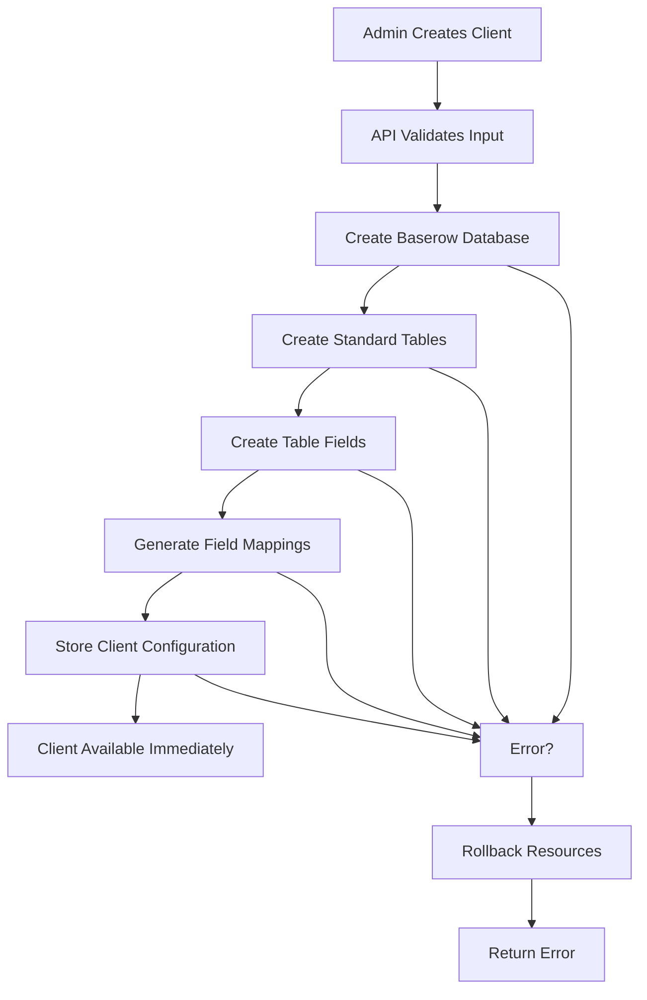

# Content Engine - Client Onboarding System

A comprehensive, automated client onboarding system with real Baserow integration, MCP server support, and AI-powered content management.

## 🚀 Features

- **Automated Baserow Setup**: Creates real databases, tables, and fields automatically
- **Multi-Client Support**: Isolated client environments with dynamic configuration
- **MCP Integration**: AI-powered client management through Model Context Protocol
- **Rollback Mechanisms**: Automatic cleanup on failure with comprehensive error handling
- **Real-time Dashboard**: Immediate access to client dashboards after creation
- **Scalable Architecture**: Production-ready system for managing multiple clients

## 📚 Documentation

| Document | Description |
|----------|-------------|
| **[Quick Start Guide](QUICK_START_GUIDE.md)** | Get up and running in minutes |
| **[Comprehensive Documentation](CLIENT_ONBOARDING_DOCUMENTATION.md)** | Complete system documentation |
| **[API Reference](API_REFERENCE.md)** | Detailed API documentation |
| **[Troubleshooting Guide](TROUBLESHOOTING_GUIDE.md)** | Solutions to common issues |

## 🏗️ Architecture

```
┌─────────────────────────────────────────────────────────────┐
│                    Content Engine System                    │
├─────────────────────────────────────────────────────────────┤
│  Admin Dashboard  │  API Routes  │  MCP Server  │  Baserow  │
│                   │              │              │           │
│  /admin/clients   │  /api/admin/ │  Multi-      │  Real     │
│  Client Forms     │  clients/    │  Client      │  Database │
│  Management UI    │  create      │  Support     │  Creation │
└─────────────────────────────────────────────────────────────┘
```

## 🎯 Quick Start

### 1. Prerequisites
- Node.js 18+
- Baserow account with admin access
- Admin token with database creation permissions

### 2. Setup
```bash
# Install dependencies
npm install
cd mcp-server && npm install && cd ..

# Configure environment
cp .env.example .env.local
# Edit .env.local with your Baserow token

# Start development server
npm run dev
```

### 3. Create Your First Client
1. Go to http://localhost:3000/admin/clients
2. Click "Add New Client"
3. Fill in client details
4. Submit and watch the magic happen!

## 🔧 System Components

### Admin Dashboard (`/admin/clients`)
- Clean, intuitive interface for client management
- Real-time progress tracking during client creation
- Client status monitoring and management

### API Routes (`/api/admin/clients/create`)
- Validates input and creates real Baserow resources
- Comprehensive error handling with automatic rollback
- Stores client configurations for immediate availability

### MCP Server Integration
- Multi-client support with dynamic configuration
- AI-powered content management tools
- Real-time client statistics and operations

### Baserow Integration
- Creates isolated databases for each client
- Standardized table structures across all clients
- Automatic field mapping generation

## 📊 Client Creation Process



## 🛠️ Standard Table Templates

Every client gets these tables automatically:

| Table | Purpose | Key Fields |
|-------|---------|------------|
| **Content Ideas** | Content planning and ideation | Title, Description, Type, Status |
| **Social Media Content** | Social media post management | Post, Platform, Content Type, Status |
| **Images** | Image asset management | Image, Prompt, Type, Style, Status |
| **Brand Assets** | Brand asset library | Asset Type, File, Platform, Status |
| **Email Ideas** | Email content planning | Subject, Content, Type, Status |
| **Templates** | Content templates | Template Name, Type, Content, Variables |

## 🔐 Security Features

- **Token Isolation**: Each client uses their own Baserow token
- **Database Isolation**: Complete separation between clients
- **Rollback Security**: Automatic cleanup prevents orphaned resources
- **Access Controls**: Proper authentication and authorization
- **Audit Logging**: Comprehensive logging of all operations

## 🚨 Error Handling

The system includes comprehensive error handling:

- **Validation Errors**: Input validation with clear error messages
- **Authentication Errors**: Token validation and permission checking
- **Resource Creation Errors**: Detailed error logging and rollback
- **Network Errors**: Retry logic and graceful degradation
- **Rollback Mechanisms**: Automatic cleanup of partial setups

## 📈 Monitoring & Logging

- **Step-by-Step Progress**: Real-time logging of each operation
- **Success Indicators**: Clear ✅ markers for successful operations
- **Error Context**: Detailed error messages with troubleshooting info
- **Rollback Logging**: Clear indication when cleanup operations occur

## 🔄 MCP Server Tools

### Content Management
- `get_content_ideas(clientId, limit?)` - Retrieve content ideas
- `create_content_idea(clientId, title, description, type, source)` - Create new ideas
- `get_social_media_content(clientId, platform?, status?, limit?)` - Get social posts
- `create_social_media_post(clientId, post, platform, type, count?, status?)` - Create posts
- `get_images(clientId, status?, limit?)` - Retrieve images
- `update_content_status(clientId, tableType, recordId, status)` - Update statuses

### Client Management
- `get_all_clients()` - List all configured clients
- `get_client_stats(clientId)` - Get client statistics
- `create_new_client(clientId, displayName, token, databaseId, tableIds)` - Create clients

## 🐛 Troubleshooting

### Common Issues

#### 401 Unauthorized
```
Failed to create database: 401 - Authentication credentials were not provided.
```
**Solution**: Use admin token with database creation permissions

#### 403 Forbidden
```
Failed to create database: 403 - You don't have the required permissions.
```
**Solution**: Ensure token has admin-level permissions

#### Table Creation Failed
```
Failed to create table contentIdeas: 400 - Bad Request
```
**Solution**: Check field template definitions and Baserow API compatibility

### Quick Fixes

1. **Test Token Validity**:
   ```bash
   curl -H "Authorization: Token YOUR_TOKEN" \
        https://baserow.aiautomata.co.za/api/applications/
   ```

2. **Use Existing Database** (for testing):
   ```typescript
   const database = { id: '176' } // Use existing database
   ```

3. **Enable Debug Logging**:
   ```bash
   DEBUG=content-engine:client-creation
   ```

## 🚀 Production Deployment

### Environment Variables
```bash
# Baserow Configuration
BASEROW_API_URL=https://your-baserow-instance.com
BASEROW_MODERN_MANAGEMENT_TOKEN=your-admin-token

# Optional Configuration
DEFAULT_DATABASE_ID=your-default-database-id
NODE_ENV=production
```

### Security Considerations
- Use strong, unique tokens for each client
- Implement proper access controls
- Set up monitoring and alerting
- Regular token rotation
- Backup procedures for client configurations

## 📞 Support

### Getting Help
1. **Check Documentation**: Start with the Quick Start Guide
2. **Review Troubleshooting**: Common issues and solutions
3. **API Reference**: Detailed API documentation
4. **Contact Support**: Development team for technical issues

### Useful Resources
- [Baserow API Documentation](https://baserow.io/docs/api-docs)
- [Model Context Protocol](https://modelcontextprotocol.io/)
- [Next.js Documentation](https://nextjs.org/docs)

## 🤝 Contributing

### Development Setup
1. Fork the repository
2. Create a feature branch
3. Make your changes
4. Add tests if applicable
5. Submit a pull request

### Code Standards
- TypeScript for type safety
- Comprehensive error handling
- Detailed logging and monitoring
- Proper documentation

## 📄 License

This project is licensed under the MIT License - see the LICENSE file for details.

## 🙏 Acknowledgments

- Baserow for providing the backend infrastructure
- Model Context Protocol for AI integration
- Next.js team for the excellent framework
- All contributors and users of the Content Engine

---

**Ready to get started?** Check out the [Quick Start Guide](QUICK_START_GUIDE.md) to create your first client in minutes!

*For detailed information, see the [Comprehensive Documentation](CLIENT_ONBOARDING_DOCUMENTATION.md).*
